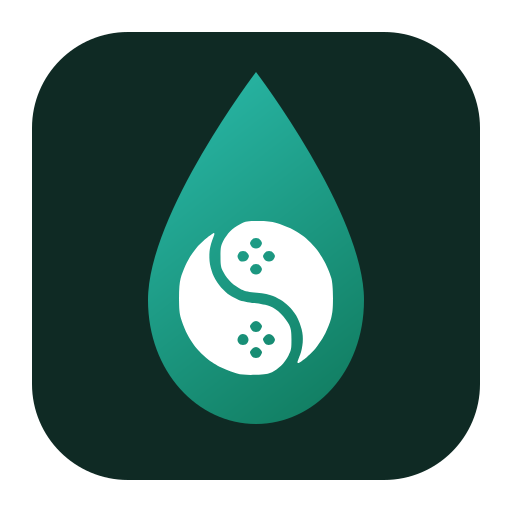

# drippu

<h1 align="center">
  <br>
  
  <br>
  <b>drippu</b>
  <br>
</h1>

<h4 align="center">
Nintendo Switch emulator and native recompiler — the experimental edition of suyu, built on the shared Eden/yuzu lineage.
</h4>

<p align="center">
  <a href="#status">Status</a> |
  <a href="#building">Building</a> |
  <a href="#license">License</a>
</p>

---

> **drippu (also known as suyu experimental), is a Nintendo Switch Emulation, Modding, Game Development and Recompiler toolkit maintained by the [suyu Emulator organization](https://github.com/suyu-emu). Started by the *new* suyu project leads, drippu acts as an Experimental sandbox for developers to try implementing changes to the codebase that may prove too radical or unstable to (yet) implement into suyu proper.**
>
> This is where the project more deeply explores some emulator, recompiler, UI, and platform work that may change quickly and significantly. Expect rough edges and evolving behavior.
>
> drippu shares suyu’s codebase and history (itself based on yuzu). Binary and internal target names may still say `suyu` in places for now, but the product presents as **drippu** and will do for the foreseeable future.

## About

drippu is a Nintendo Switch emulator and AArch64 native recompiler written in C++. It can run decrypted Switch titles using either:

- **HLE/emulation mode** — full hardware-level emulation via the drippu core (GPU, CPU, audio, services)
- **Recompiler mode** — ahead-of-time static recompilation of Switch AArch64 game code to native x86-64 executables, bundled with drippu's HLE backend

Part of the suyu project and based on [Eden](https://git.eden-emu.dev/eden-emu/eden), drippu is a space for experimental UI, recompiler, and platform work.

## Status

drippu is maintained by the suyu Emulator organization as its experimental project. Automated builds are published to the [releases page](../../releases) by GitHub Actions (Windows, Linux, macOS, Android, Libretro and FreeBSD) when configured.

Platforms: Windows and Linux both build and run. macOS (arm64) builds and runs through
Vulkan/MoltenVK with the bundled MoltenVK library; see [macOS](#macos). Android is inherited
from upstream. iOS is in progress.

For our rough plan, read [ROADMAP.MD](docs/ROADMAP.md).

## Legal Notice

drippu is a GPLv3 program, which allows fully free redistribution of its source code and releases liability of its authors for how this software is used as stated in Section 15 and 16.

The drippu Emulator program does not circumvent Nintendo's technological protection measures (TPMs) as the user is required to provide both the Nintendo Switch software & the encryption keys for these games, and the drippu Emulator uses a mode of the Advanced Encryption Standard (AES), an open encryption standard established by the US NIST, along with the encryption keys that the user themselves must lawfully acquire, to decrypt the software. As the standard is public and available to use by all, it does not constitute as the Digital Market Copyright Act's (DMCA) definition of "circumventing a technological measure" as defined in Section 1201(a)(3).

The drippu Emulator also falls under the exemptions stated in Section 1201(f) of the DMCA as this software was created for the purposes of reverse engineering the Nintendo Switch software (known as Horizon OS) to create interoperability with Nintendo Switch games and software with the Windows, macOS, and GNU/Linux operating systems.

Any aggressive DMCA claims or takedown notices against projects that explicitly disclaim piracy support, require user-provided keys, and limit functionality to interoperability (such as drippu) could constitute overreach or misuse of the DMCA.

As derived from §512(f), if Nintendo (or an affiliated entity) knowingly materially misrepresents that a project like drippu is infringing (or circumvents TPMs) when it does not, especially if they fail to consider fair use, interoperability exemptions under §1201(f), or the fact that the emulator requires user-provided keys and does not itself contain proprietary Nintendo code, they can be made liable for any Damages against drippu.

## Building

### Dependencies

- CMake 3.15+, Ninja
- Qt 6.4+ (without bundled Qt: `-DYUZU_USE_BUNDLED_QT=OFF`)
- Vulkan SDK, libusb, OpenSSL

### Windows

```bat
cmake -B build -DCMAKE_BUILD_TYPE=Release -DENABLE_QT=ON -DYUZU_USE_BUNDLED_QT=OFF -GNinja
cmake --build build --target suyu suyu-cmd
```

### Linux

```sh
sudo apt-get install ninja-build qt6-base-dev libqt6svg6-dev libusb-1.0-0-dev libssl-dev
cmake -B build -DCMAKE_BUILD_TYPE=Release -DENABLE_QT=ON -DYUZU_USE_BUNDLED_QT=OFF -GNinja
cmake --build build --target suyu suyu-cmd
```

### macOS

Apple Silicon (arm64), with the Xcode command line tools and Homebrew:

```sh
brew install cmake ninja pkgconf boost ffmpeg sdl3 libusb enet glslang nasm qt
```

Then the same configure as Linux, plus Homebrew's prefix so Qt, FFmpeg and SDL3
are found:

```sh
cmake -B build-macos -GNinja \
  -DCMAKE_BUILD_TYPE=Release \
  -DENABLE_QT=ON -DYUZU_USE_BUNDLED_QT=OFF \
  -DYUZU_TESTS=OFF -DENABLE_WEB_SERVICE=OFF \
  -Dfmt_FORCE_BUNDLED=ON \
  -DVulkanHeaders_FORCE_BUNDLED=ON \
  -DCMAKE_PREFIX_PATH="$(brew --prefix)"
cmake --build build-macos --target suyu suyu-cmd
```

`-DVulkanHeaders_FORCE_BUNDLED=ON` is the macOS counterpart of Linux's
`fmt_FORCE_BUNDLED`. Homebrew's `vulkan-headers` is found while
`vulkan-utility-libraries` is not, and `AddDependentPackages` refuses that
mixture, so configure stops with *"Partial dependency installation detected"*
rather than pairing a system copy of one with a bundled copy of the other. On a
machine with neither installed the flag is not needed.

glslang 16 ships `glslang` with `glslangValidator` as a symlink to it, so the
host shader step still finds the program by the old name.

Binaries land in `build-macos/bin`: `suyu.app` and `suyu-cmd`. Release packaging
copies the Qt bundle to `drippu.app`.

MoltenVK comes from the bundled CPM package (`V380-Ori/Ryujinx.MoltenVK`,
`v1.4.1-ryujinx`) by default (`YUZU_USE_BUNDLED_MOLTENVK=ON` on Apple). It is
copied into `suyu.app/Contents/Frameworks/`, and that is the copy
`Vulkan::OpenLibrary` loads: it tries `LIBVULKAN_PATH` (unset for the app
default), then the bundle's `libvulkan.1.dylib` and `libMoltenVK.dylib`. The
app therefore does not need MoltenVK installed. Pass
`-DYUZU_USE_BUNDLED_MOLTENVK=OFF` to prefer an installed copy (Homebrew
`molten-vk`). GitHub Actions `release.yml` `build-macos` uses OFF + brew so the
scheduled artifact can ship Homebrew's dylib; the PR `macos-moltenvk-smoke` job
uses ON (the documented local default) and runs the smoke from inside
`suyu.app` with `LIBVULKAN_PATH` unset.

`suyu-cmd` / `drippu-cmd` sit next to the bundle, not inside it, so they do not
see `Contents/Frameworks` unless you export `LIBVULKAN_PATH` to a
`libMoltenVK.dylib` (the one inside `suyu.app` or Homebrew's).

macOS does not have NCE support yet. `HAS_NCE` is enabled for Android and Linux
arm64 only, so the CPU runs on dynarmic's arm64 backend, whose Mach
exception handler builds and links here.

### Android

```sh
cd src/android && ./gradlew assembleMainlineRelease
```

Build targets remain `suyu` / `suyu-cmd` for now (deep path and target renames are deferred). User-facing strings and docs say **drippu**.

## License

GPL-3.0-or-later. See [LICENSE.txt](LICENSE.txt).
